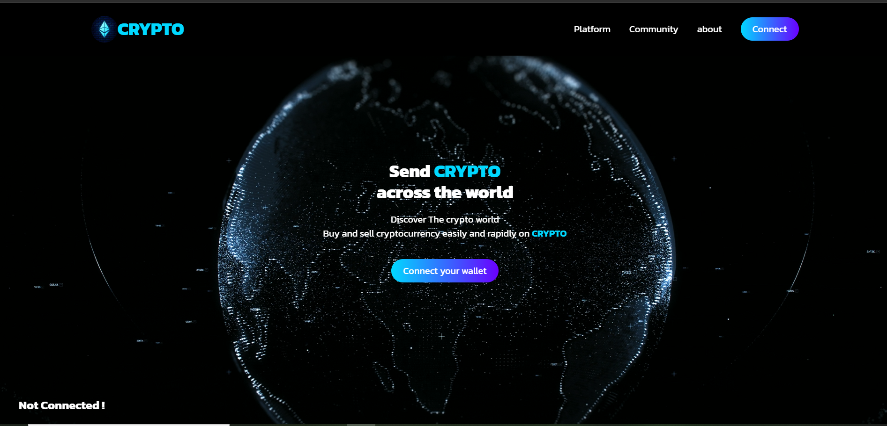
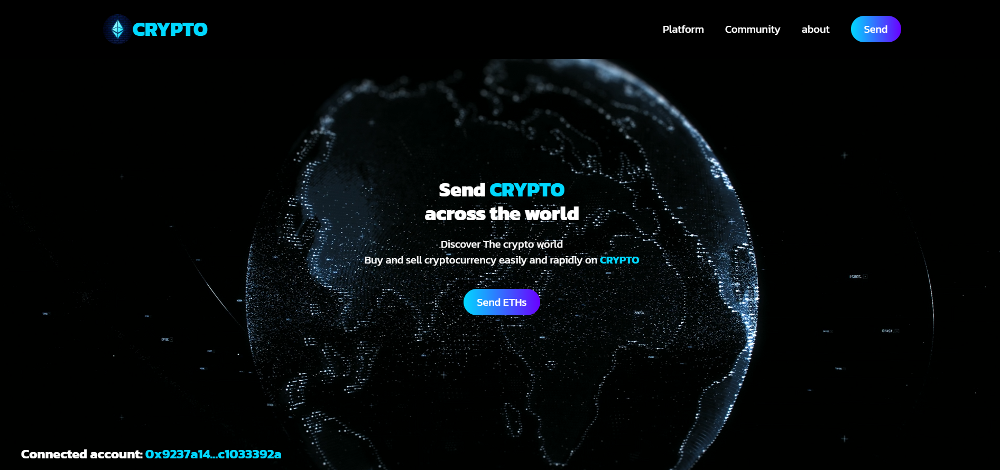
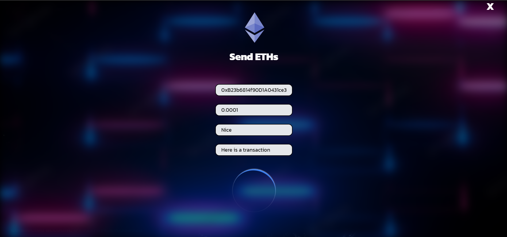
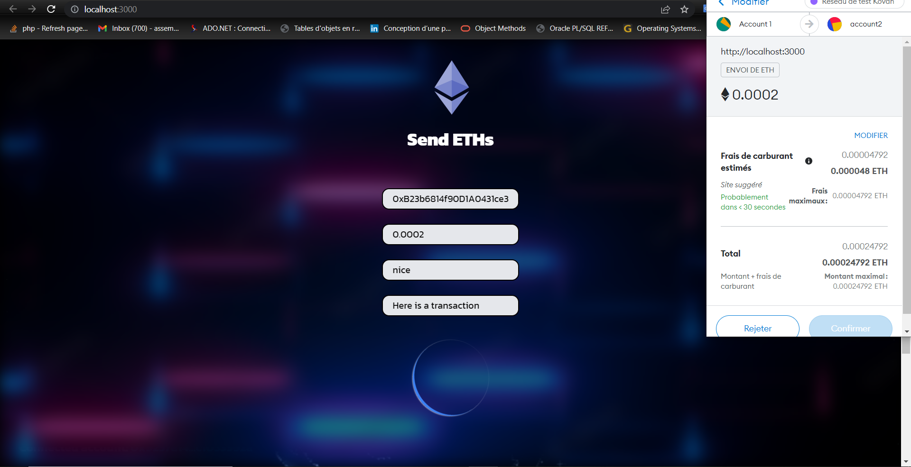
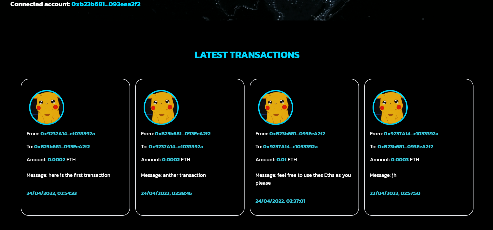

# WEB3 SENDER CURRENCIES

- In this project, I built a web3 application connected to the blockchain and using the smart contract in order to send Eth (currency) through the Ethereum Blockchain network.
- The functionalities are written in the smart contract with the Solidity code.
- The WEB3.js library is used to connect the website, developed with ReactJS, to the Ethereum Blockchain.

# Demonstration
- The home page is the following 
 

- Once the user has connected his wallet, the address is detected automatically. Then he can make transactions and send Eths. 
 

- To send Eths, click on the "Send Eths" button and a form will appear.

- Then we fill in the required form fields.

- Next, we confirm the transaction within MetaMask

- Lastly, we can list all the transactions made with the website.

